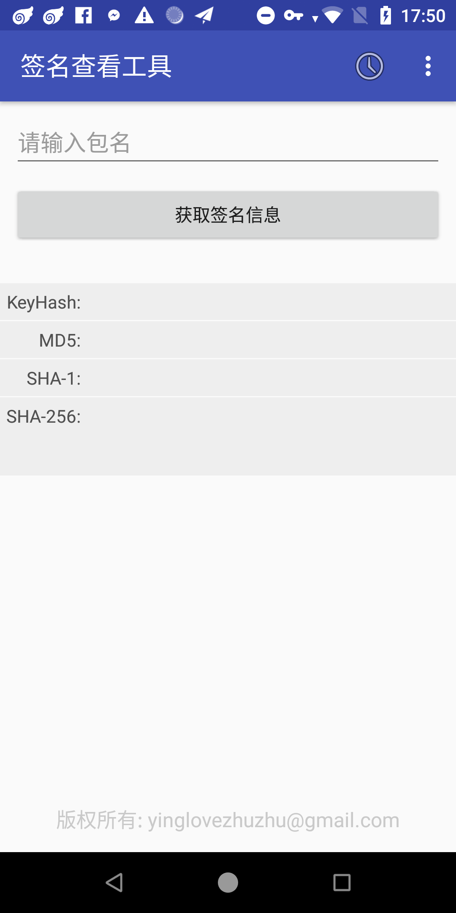
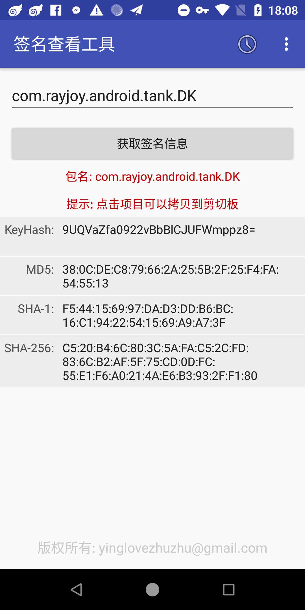

# Android签名信息查看工具

## 介绍

Android签名查看工具是一个查看Android应用签名信息的工具，分别以秘钥散列、MD5、SHA-1和SHA-256方式展示签名信息，方便开发者和运营同事核对应用的签名信息。

> __注意：查看签名的目标应用必须在设备上已安装。__

## 使用方法

###  下载安装apk
签名查看工具apk[下载地址](https://github.com/yinglovezhuzhu/SignTool/releases/tag/v2.1.0)

### 打开应用

### 确定查看签名的目标应用
可以通过几种方式选择查看的目标应用：
1. 通过输入目标应用的包名，在主界面的输入框中输入目标应用的包名
2. 如果之前查看过该应用签名，可在使用历史中选择包名
3. 点击右上角的更多菜单，点击“选择应用”可打开已安装的应用列表页面，可快速浏览选择已安装的应用

点击“获取签名信息”可获取目标应用的签名信息

> 提示：点击项目可以复制内容到剪切板。

